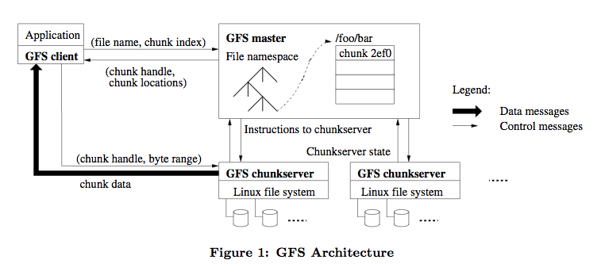
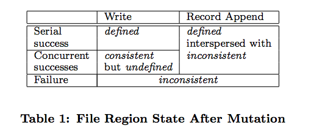
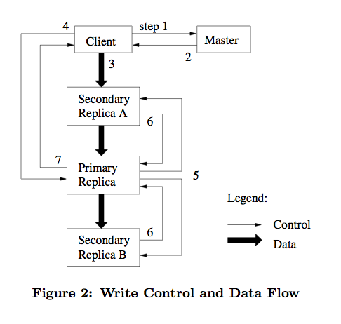

# Lec 03 : GFS

# GFS Lecture

## Principle

- 组件失效被认为是常态事件，而不是意外事件。(强调错误处理、降低组件成本)
- 文件尺寸巨大，数据量巨大，经常有上 GB 的单个文件出现。
- 多客户端 **并发追加** 量大，有极少的 **随机写** 行为。绝大部分文件的修改是采用在文件尾部追加数据，而不是覆盖原有数据的方式。(符合实际的操作预期)。
- 应用程序和文件系统 API 的协同设计提高了整个系统的灵活性。
- 一次写入，多次读取，类似网页存储。

## Interface

1. 类似传统的文件系统 API
2. 提供快照和追加记录的功能，每个客户端可以原子性操作(成本很低)，可以实现多路结果合并。

## Arch



GFS 集群包含一个 Master 和多个 Chunk Server 组成，各个 Server 都可以独立和 Client 进行连接和数据通信。 

Master、Chunk、Client 的低耦合的实现方案，跟 MR 本身也有异曲同工之处。Files 会被分割成大小固定的 Chunk 实际存储于 Chunk 的文件系统之中，每个 Chunk 创建的时候就会有一个 Global Unique ID。可以存在多个复制，空实现默认三个。

Chunk：在 gfs 里，一个大的文件会分为多个 chunks 。一个chunk的大小是固定的，是 64mb ，一个 chunk 是数据复制的基本单位。当 client 要读一个文件的时候，在 send request 的时候其实会把 file name 和 chunk index 发给 master。master 会将每个 chunk index 所在的 chunkserver 返回给 client。

- Master: 存储系统元数据信息，主要包括namespace、文件chunk信息以及chunk多副本位置信息。Master是系统的中心节点，所有客户端的元数据访问，如列举目录下文件，获取文件属性等操作都是直接访问Master。
- Chunk Server：是文件 Chunk 的存储位置。每个数据节点挂载多个磁盘设备并将其格式化为本地文件系统（如XFS）。将客户端写入数据以 Chunk 为单位存储，存储形式为本地文件。

Master 管理 Chunk 的各种信息，在固定的心跳周期内会对 Chunk Servers 进行轮训。Master 的只包含数据的 meta-data ，client 拿到具体的 meta-data 之后会和 Chunk Servers 进行直接联系。

## Key Points

### 元数据 MetaData 

主服务器保存的元数据主要为：**文件命名空间**、**文件到数据块的映射**和**数据块的位置**。文件命名空间和文件到数据块的映射的数据需要持久化地写入到一个**操作日志**中，而数据块的位置通过和块服务器通信获得。

这些元数据需要保存在主服务器的内存中来加速访问。主服务器在运行中会周期性地进行扫描，来完成数据块**垃圾回收**、故障块服务器数据**重备份**以及迁移数据块进行**负载均衡**。

**操作日志**记录了元数据地修改历史，主要用于故障恢复。显然，操作日志还需要在主服务器之外的远程服务器备份，所有操作必须在写入到操作日志之后执行。操作日志通常会结合检查点机制进行高效地备份。

1. the file and chunk namespaces,  文件、Chunk 的命名空间
2. the mapping from files to chunks, 文件、Chunk 的 Mapping 关系
3. and the locations of each chunk’s replicas.  每个 Chunk 的副本位置

前两者在 Master 的 log 里面也会存一份缓存到 disk 上面，防止 Master 的意外崩溃。Master 只在内存上缓存数据，而是会启动轮询 Chunk Server 去拿相应的信息。

Master 上的 MetaData 会定期存储到文件系统上，64 bit 就能管理一个 64 M 的 Chunk ，因此 Master 的内存消耗和扩容问题都不大。

Opertation Log —— 操作日志上保存着 GFS 的重要信息在写入 disk 前对 Client 不可见，并且有多个远程备份，在错误回复阶段使用 Log 进行重做，加入 CheckPoint 的设定，能够减少需要恢复的量。压缩 B 树的文件结构能够直接映射到内存。


### 一致性模型 Consistency model
```
The state of a file region after a data mutation depends on the type of mutation, whether it succeeds or fails, and whether there are concurrent mutations. Table 1 summa- rizes the result.
```


#### **概念** 

- **consistent** : 如果所有客户端不论从哪一个备份中读取同一个文件，得到的结果都是相同的，那么我们就说这个文件空间是一致的。

- **defined：**如果一个文件区域在经过一系列操作之后依旧是一致的，并且客户端完全知晓对它所做的所有操作。一个操作如果没有被其他并发的写操作影响，那么这个被操作的文件区域是 defined 的。

- 成功的并发操作也会导致文件区域 undefined，但是一定是一致的（consistent）（客户端有可能只看到了最终一致的结果，但是它并不知道过程）。

- 失败的并发操作会导致文件区域 undefined，所以一定也是不一致的（inconsistent）。

- GFS 并不需要是因为什么导致的 undefined（不区分是哪种 undefined），它只需要知道这个区域是 undefined 还是 defined 就可以。

#### **数据改变**

- **write** ：往应用程序指定的 offset 进行写入
- **record append** ：往并发操作进行过的 offset 处进行写入，这个 offset 是由 GFS 决定的（至于如何决定的后面会有介绍），这个 offset 会作为 defined 区域的起始位置发送给 client。
- **“regular” append** ：对应于 record append 的一个概念，普通的 append 操作通常 offset 指的是文件的末尾，但是在分布式的环境中，offset 就没有这么简单了

#### **行为确保**

```
After a sequence of successful mutations, the mutated file region is guaranteed to be defined and contain the data writ- ten by the last mutation.
```

1. GFS 通过在所有的备份（replicas）上应用顺序相同的操作来保证一个文件区域的 defined（具体细节后面会讨论）—— 3.1 章
2. GFS 会使用 chunk version（版本号）来检测 replicas 是否过期，过期的 replicas 既不会被读取也不会被写入
3. GFS 通过握手（handshakes）来检测已经宕机的 chunkserver
4. GFS 会通过校验和（checksuming）来检测文件的完整性


### 读流程 Read Steps

> Client 直接与 Chunk Server 进行联系



1. Chunk Size 固定能够根据文件找到 index 
2. Client 发送包含文件名和 Chunk Index 的请求到 Master
3. Master 回复 Chunk Handle 和 Chunk Location (多个副本)   (Client 缓存了返回的 Meta 信息)
4. Client 直接和最近的 Chunk Server 联系，并且在缓存信息过期前都不会再进行请求了

**选择 64 M 的 Chunk Size 好处都有啥**：

1. 减少 Client 和 Master 的交互，可以多次在一个 Chunk 上面工作。

2. 对同一个块进行多次交互能够保持 TCP 的连接时间，减少网络负载。

3. Master 存储的 MetaData 信息能够更少，减少 Master 的内存压力。

   缺陷：热点过载，批处理程序可能在同时都在请求同一个 Chunk 的文件块，可能的解决方案是增加复制量，或者允许 Client -> Client 的数据流动。

## 系统间交互

- Mutation：mutation 指的是改变了 chunk 的内容或者 metadata，每一次 mutation 都应该作用于所有的备份
- Lease: GFS 使用租约机制（lease）来保障 mutation 的一致性.多个备份中的一个持有 lease，这个备份被称为 primary replica（其余的备份为 secondary replicas），GFS 会把所有的 mutation 都序列化（串行化），让 primary 直行，secondary 也按相同顺序执行，primary 是由 master 选出来的。一个 lease 通常60秒会超时。

### 普通写操作 Normal Write


操作步骤 (7)：

1. client 向 master 请求持有 lease 的 chunk（primary replica）位置和其他 replicas 的位置（如果没有 chunk 持有 lease，那么 master 会授予其中一个 replica 一个 lease）
2. master 返回 primary 的信息和其他 replicas 的位置，然后 client 将这些信息缓存起来（只有当 primary 无法通信或者该 primary replica 没有 lease 了，client 才会向 master 再次请求）
3. client 会将数据发送到所有的 replicas，每个 chunkserver 会把数据存在 LRU 缓存中。
4. 在所有的 replicas 都收到了数据之后，client 会向 primary 发送写请求。primary 会给它所收到的所有 mutation 分配序列号（这些 mutation 有可能不是来自于同一个 client），它会在自己的机器上按序列号进行操作。
5. primary 给 secondaries 发送写请求，secondaries 会按相同的序列执行操作
6. secondaries 告知 primary 操作执行完毕
7. primary 向 client 应答，期间的错误也会发送给 client，client 错误处理程序（error handler）会重试失败的 mutation

### 数据流 DataFlow

> 见上图 DataFlow 和  Write Control

Client 的 control flow 和 data flow 的流程是拆分的，data flow 是有精心选择的管道的，链式发送。每台机器都通过 ip 计算 distance 然后在找同 switch 之下距离最近的一个 replica 副本。通过 TCP 连接将数据传输流水线化（pipelining），pipelining 之所以能够有效果是因为 GFS 的网络是全双工的交换网络。

### 原子记录追加 Record Append

GFS 的 record append 操作仅能保证数据在一个原子单位中被写了一次，并不能保证对所有的 replicas 操作的位置都是相同的，比如每次写入的 offset 相同，但是 chunk 有可能不一样。record append 最大不超过 chunk size 的四分之一。

```
Record append is a kind of mutation and follows the control flow in Section 3.1 with only a little extra logic at the primary. The client pushes the data to all replicas of the last chunk of the file Then, it sends its request to the pri- mary. The primary checks to see if appending the record to the current chunk would cause the chunk to exceed the maximum size (64 MB). If so, it pads the chunk to the maximum size, tells secondaries to do the same, and replies to the client indicating that the operation should be retried on the next chunk. (Record append is restricted to be at most one-fourth of the maximum chunk size to keep worst- case fragmentation at an acceptable level.) If the record fits within the maximum size, which is the common case, the primary appends the data to its replica, tells the secondaries to write the data at the exact offset where it has, and finally replies success to the client.
```

与普通的写操作的区别是：

1. 没有指定的 index：Client 不需要指定的 Chunk Index ，因为会直接写进最后一个 Chunk 进行 Append 操作
2. Client 发送请求到 Primary Server 是否超过 Chunk Size 的最大大小，如果超过了就会通知所有的 Secondaries 和自己一样做 Padding 填满当前 Chunk，然后把追加数据放在新的 Chunk 里面。
3. 如果副本出现错误，会进行重试因此会产生这次 record append 在每个 Chunk 的表现都是不同的，还可能包含重复写入的数据。但是 GFS 不保证所有副本的字节是相同的，它仅保证数据至少原子追加了一次，所以成功写入的数据一定是报告在所有副本相同的 offset 写入了数据，并且最后长度也是一样的，这样情况写入的数据是 defined 的。

### 快照 Snapshot 

GFS 通过 snapshot 添加快照，使用了 Copy On Write (写时复制) 与 Linux 进程的范式相同。

当 master 收到 snapshot 操作请求后：

1. 废除所有的 lease，准备 snapshot（相当于暂停了所有写操作，因为这样所有直接到 Chunk 的写操作支持就失效了，就会重新和 Master 进行连接）。
2. master 记录所有操作，并且将记录写入磁盘。
3. master 将源文件和目录树的 metadata 进行复制，这样之前的记录就和当前的内存中所保存的状态对应起来了，新建的 snapshot 和源文件指向的会是同一个 chunk

### Master 职责

>  Single Master 通过 Client 直接连接 Chunk 以及冗余备份的高可用特性解决单点 Master 的故障问题

- 执行所有有关于 namespace 的操作
- 管理整个系统的 chunk replicas：
  - 做出 chunk replicas 的放置决定
  - 创建 chunk/replicas
  - 协调各种操作，保证 chunk 被完全复制
  - 负载均衡
  - 回收闲置空间

GFS 的namespace 是一个查找表（lookup table），并且采用了前缀压缩的方式存储在内存中，它是一个树结构，namespace 树中的每一个节点（文件名或者目录名）都有一个读/写锁。

在 Master 对文件或者目录进行操作之前它首先需要获取一个锁，比如要对 /d1/d2/…/dn/leaf 进行操作，需要获得 /d1, /d1/d2, /d1/d2/…/dn的读锁，需要 /d1/d2/…/dn/leaf 的读锁或者写锁（根据不同的操作，锁也不同）

**当/home/user 被快照备份至/save/user 时，如果此时要创建/home/user/foo 会发生什么呢？**

快照操作获得了/home, /save 的读锁和/home/user, /save/user 的写锁。创建/home/user/foo需要/home, /home/user的读锁和/home/user/foo 的写锁。因为两个操作在 /home/user的锁上产生了冲突，所以操作会依次执行，在完成 snapshot 操作之后，释放了/home/user 的写锁， /home/user/foo才会被创建。

### Chunk 副本创建

Chunk 创建，重新复制和重新负载均衡。

replicas 创建考虑因素：

1. 磁盘使用率
2. 最近 Chunk Server 最近创建次数
3. Chunk 分布多机架

Master 创建的原因：副本数量不够、损坏。会根据现有副本数量和复制因数进行排序优先级。

当 master 决定了备份哪个之后，会把当前可用的 chunk 直接克隆到目标位置（遵循replicas 放置规则），新副本考虑因素和 replicas  创建差不多，会限制流量和访问频率。

Master 会周期性质的对 Chunk Server 进行负载均衡的操作，让 Chunk 逐渐填满而非被新 Chunk 一次性填满，通常对磁盘利用率低于平均值的 Chunk 进行移动操作。

### 辣鸡回收

惰性删除、操作计入 log 、标记隐藏，在可配置的时间内进行清理。

常规扫描还会扫描孤儿 Chunk (不被任何文件包含的 Chunk) 清除其中的 meta-data。

### 过期失效的副本检测

chunkserver 宕机或者是 mutation 的丢失会导致 replica 的过期，GFS 是如何对 replicas 进行检测，判断它们是否是最新的呢？

GFS 对于每一个 chunk 都会有一个版本号，这个版本号由 master 进行管理，通过版本号可以对过期的 replica 进行甄别。当 master 授予 lease 的时候，会增加版本号并且通知所有未过期的 replicas，master 和 replicas 都会记录下最新的版本号（这些操作需要在客户端进行写入操作之前完成）。如果这时，有一个 replica 不可用了，它的版本号就不会再增加了，在 chunkserver 重启或者重新向 master报告它的版本号时，master 就会知道这个 replica 已经过期了，并且会在垃圾回收时将它进行回收。如果 master 的版本号落后了呢，它会更新自己的版本号。

## Lec QA

**consistency** 一致性， 强一致性、弱一致性

**consistency models** 一致性模型，更多的权衡条件

```
"Ideal" consistency model
  Let's go back to the single-machine case
  Would be nice if a replicated FS behaved like a non-replicated file system
    [diagram: many clients on the same machine accessing files on single disk]
  If one application writes, later reads will observe that write
  What if two application concurrently write to the same file?
    Q: what happens on a single machine?
    In file systems often undefined  --- file may have some mixed content
  What if two application concurrently write to the same directory
    Q: what happens on a single machine?
    One goes first, the other goes second (use locking)

Challenges to achieving ideal consistency
  Concurrency -- as we just saw; plus there are many disks in reality
  Machine failures -- any operation can fail to complete
  Network partitions -- may not be able to reach every machine/disk
  Why are these challenges difficult to overcome?
    Requires communication between clients and servers
      May cost performance
    Protocols can become complex --- see next week
      Difficult to implement system correctly
    Many systems in 6.824 don't provide ideal
      GFS is one example
```

**GFS goals**

```
Q: Besides availability of data, what does 3x replication give us?
   load balancing for reads to hot files affinity
```

A: 除了读写负载均衡之外也有防止 Chunk 访问出现错误的问题。

```
    Q: why not just store one copy of each file on a RAID'd disk?
       RAID isn't commodity
       Want fault-tolerance for whole machine; not just storage device
```

A: 这里说的是做整机的容错而不是以文件力度。

```
Q: why are the chunks so big?
```

**选择 64 M 的 Chunk Size 好处都有啥**：

1. 减少 Client 和 Master 的交互，可以多次在一个 Chunk 上面工作。

2. 对同一个块进行多次交互能够保持 TCP 的连接时间，减少网络负载。

3. Master 存储的 MetaData 信息能够更少，减少 Master 的内存压力。

   缺陷：热点过载，批处理程序可能在同时都在请求同一个 Chunk 的文件块，可能的解决方案是增加复制量，或者允许 Client -> Client 的数据流动。

```
  GFS master server knows directory hierarchy
    for directory, wht files are in it
    for file, knows chunk servers for each 64 MB
    master keeps state in memory
      64 bytes of metadata per each chunk
    master has private recoverable database for metadata
      operation log flushed to disk
      occasional asynchronous compression info checkpoint
      N.B.: != the application checkpointing in 搂2.7.2
      master can recovery quickly from power failure
    shadow masters that lag a little behind master
      can be promoted to master
```

```
References
  http://queue.acm.org/detail.cfm?id=1594206  (discussion of gfs evolution)
  http://highscalability.com/blog/2010/9/11/googles-colossus-makes-search-real-time-by-dumping-mapreduce.html
```